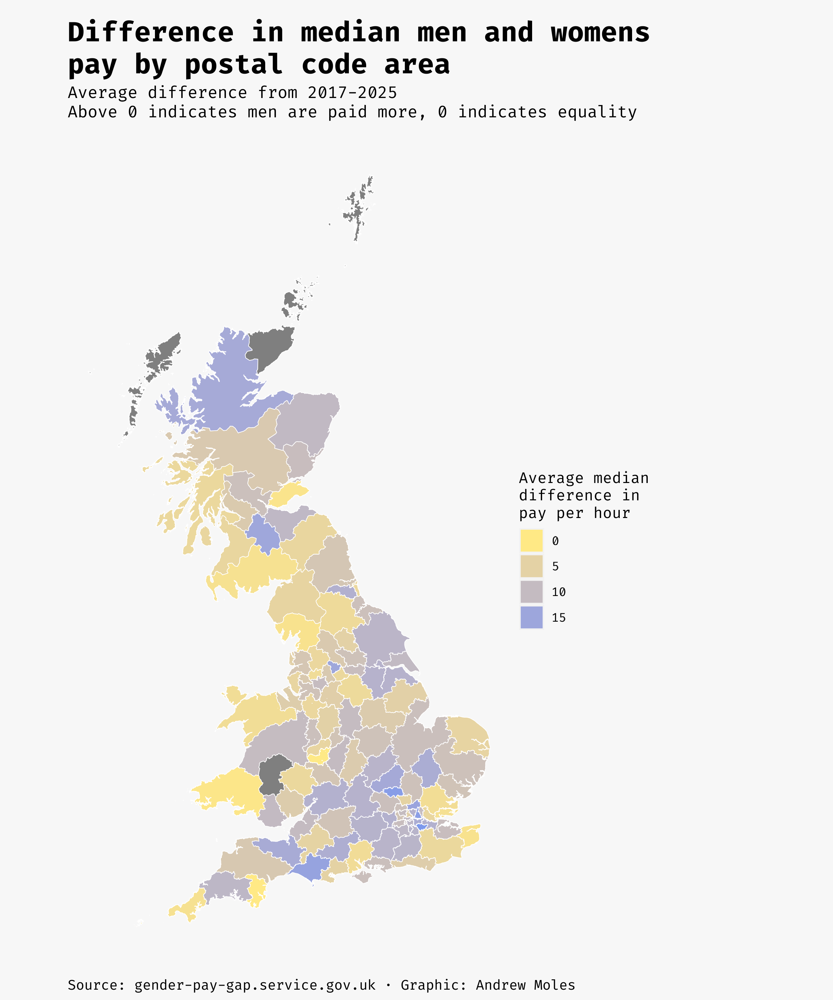
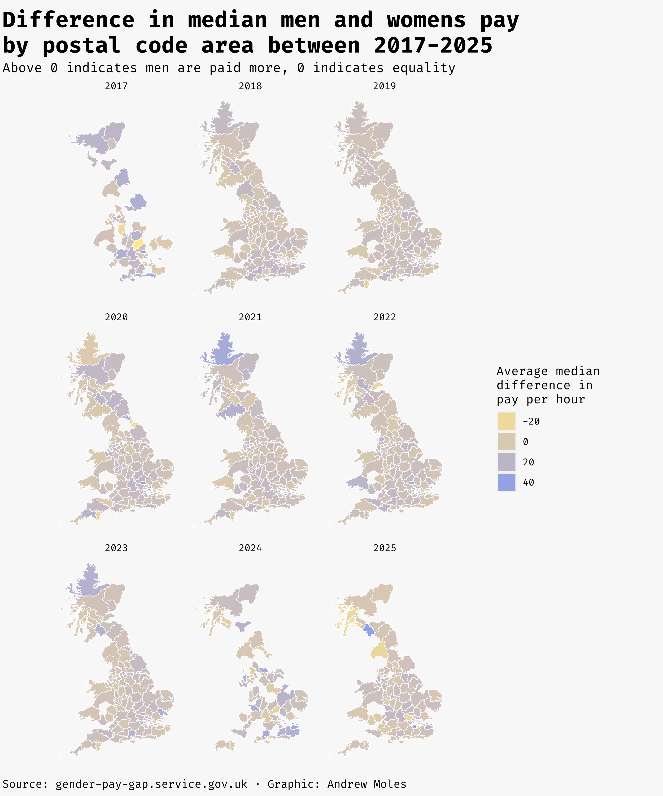
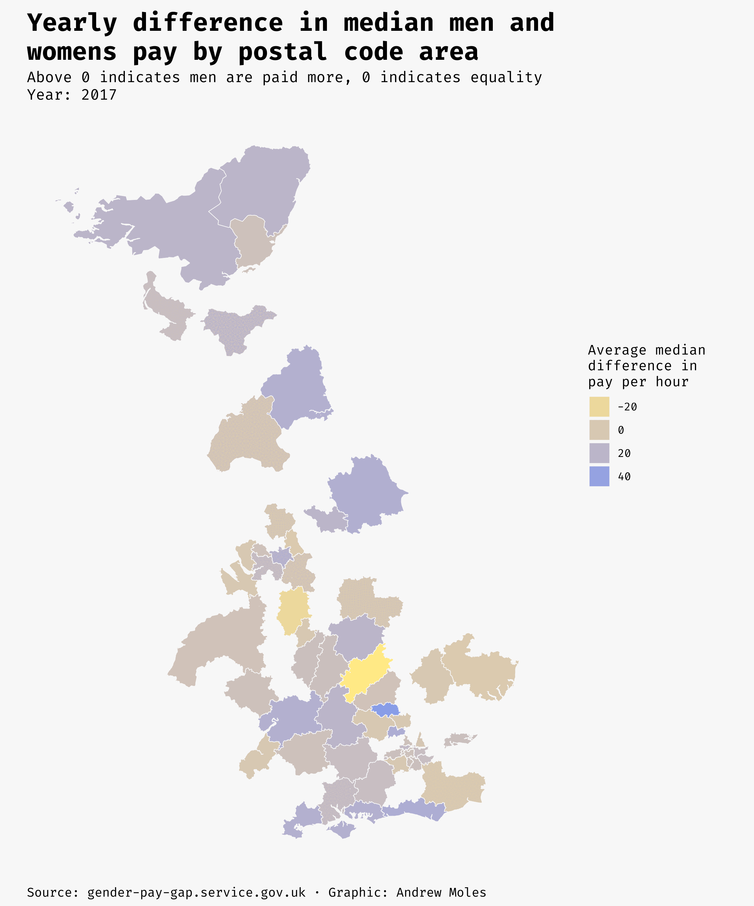
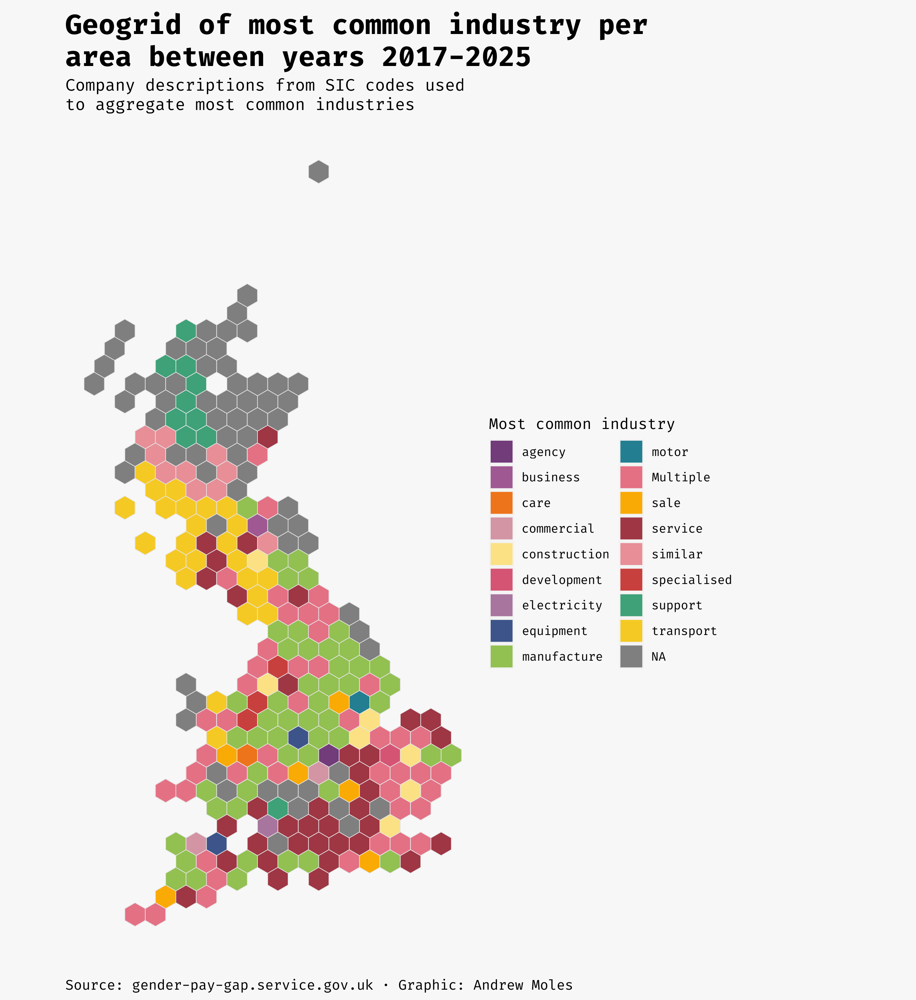
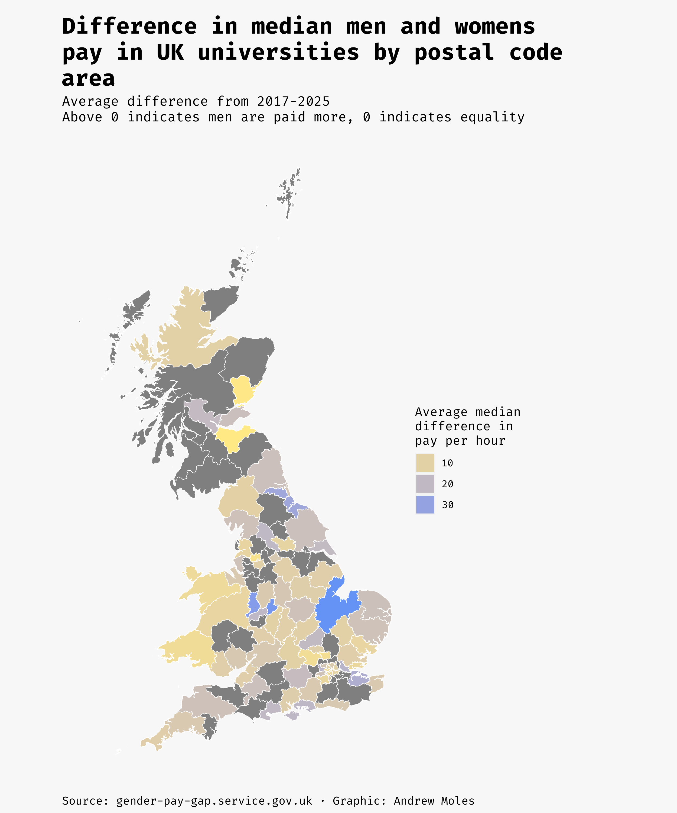
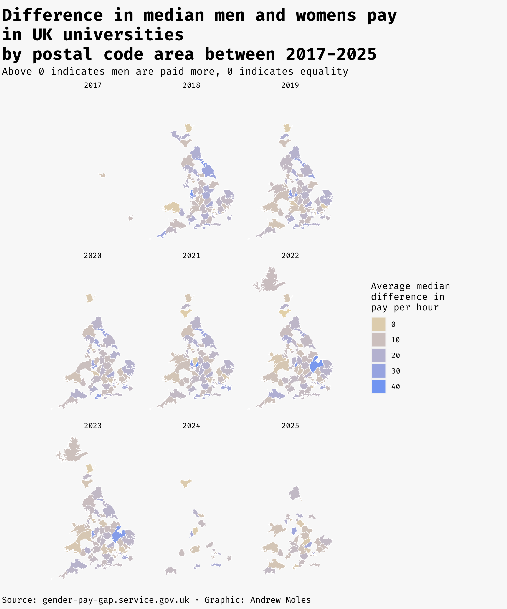

# gender_pay_gap &nbsp; :woman: :moneybag: :man:

This repo is for analysis and visualisations from the [the gender paygap service](https://gender-pay-gap.service.gov.uk/) data releases.

Data gets released each year, and as such the script and visuals will be updated to match the new data for that year. Data is manually downloaded from [data download page](https://gender-pay-gap.service.gov.uk/viewing/download)

The `paygap_prep.R` script takes all the datasets and joins them up into one dataset. 

The `paygap.R` script makes the visuals you see below. 

This is a interesting dataset which allows for many different types of visualisations. Below are several figures looking at postcode mapping this dataset. 

## Using postcodes to map aggregate pay differences by area

## Using geo grids to map which industries are most common by area

This visual links up the the SIC codes dataset, which provides description of companies. Key words where extracted using tidytext, which there then aggregated over by area to create this visual. 

## Looking at pay differences for universities by post code area

When there are gaps it means data was not submitted. 

